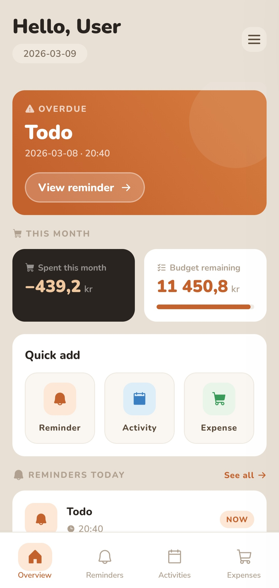
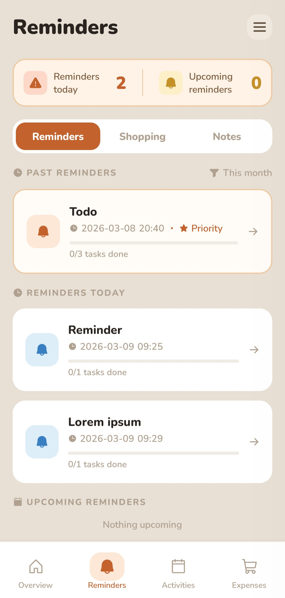
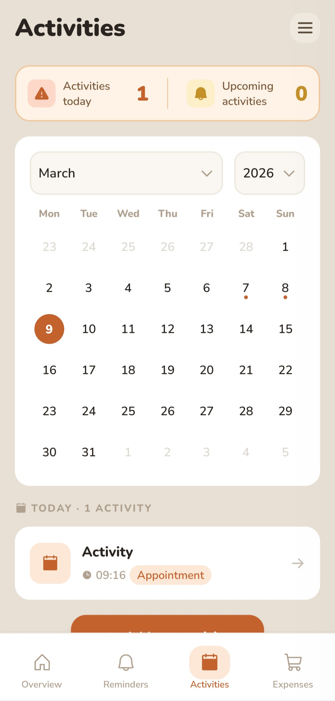
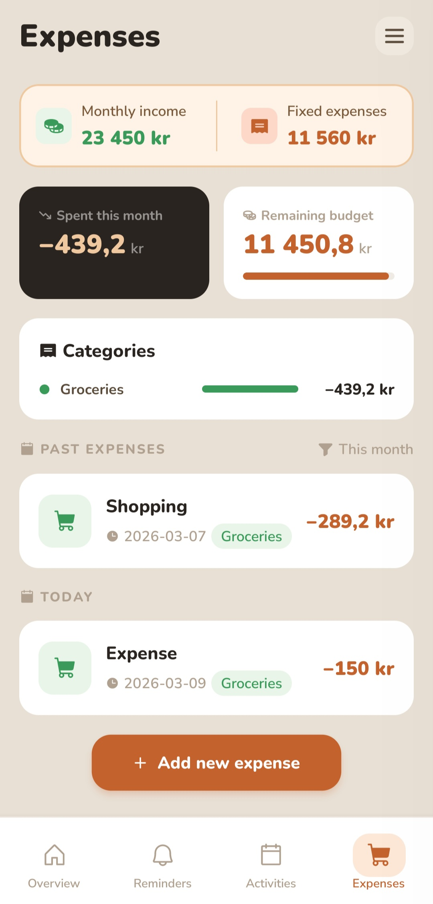
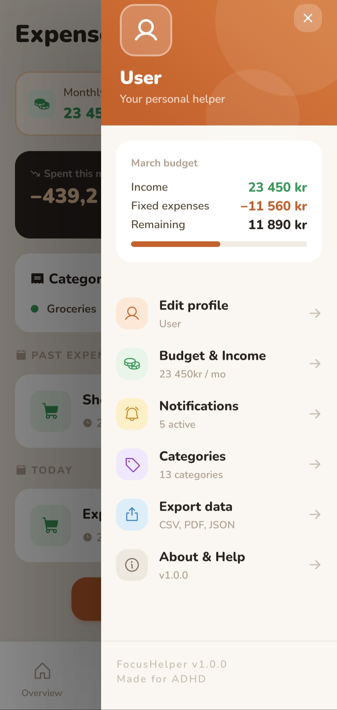

# Focus Helper

A mobile app built for people with ADHD to help manage daily life - tracking reminders, activities, and expenses in one
place, with a calm and distraction-free interface.

---

## Screenshots

| Overview                              | Reminders                               | Activities                                | Expenses                              | Sidebar                             |
|---------------------------------------|-----------------------------------------|-------------------------------------------|---------------------------------------|-------------------------------------|
|  |  |  |  |  |

---

## Features

### Reminders

Create reminders with optional tasks, due dates, and times. Reminders are organized by type (e.g. Reminders, Shopping,
Notes) and split into past, today, and upcoming sections. Each task can be checked off individually, and when all tasks
are complete the app prompts you to delete the reminder. Reminders can be prioritized to make them stand out.

### Activities

Log activities with a date, time, category, and optional description. Activities can be prioritized and are organized by
past, today, and upcoming. Categories are color-coded and split between activity types (e.g. Meeting, Errand,
Appointment).

### Expenses

Track spending with a title, amount, date, category, location, and description. Expenses are displayed with a running
total and support range filtering by week, month, or all time. A budget overview shows monthly income, fixed expenses,
and discretionary spending at a glance.

### Overview

A home screen showing a summary of today's reminders, upcoming items, and quick-add buttons for all three entity types.
Quick-adding opens a form as a modal and returns you to the overview on save.

### Settings (Sidebar)

A slide-in sidebar with sections for:

- **Profile** - set your name and preferred greeting style
- **Budget** - configure monthly income and fixed expenses
- **Notifications** - toggle notification preferences per category
- **Categories** - view built-in expense and activity categories, manage custom ones
- **Export** - export your data
- **About** - app info

---

## Tech Stack

| Area       | Technology                        |
|------------|-----------------------------------|
| Framework  | React Native + Expo (SDK 52)      |
| Routing    | Expo Router (file-based)          |
| Database   | expo-sqlite via Drizzle ORM       |
| Migrations | Drizzle Kit                       |
| Forms      | React Hook Form                   |
| UI         | Custom components, Phosphor icons |
| Fonts      | Nunito + Nunito Sans              |

---

## Project Structure

```
src/
  app/                  # Expo Router file-based routes
    (tabs)/             # Tab navigator screens
      reminders/        # Reminder list + detail
      activities/       # Activity list + detail
      expenses/         # Expense list + detail
    reminders/new.tsx   # Form screens (modals, outside tabs)
    expenses/new.tsx
    activities/new.tsx
  components/           # Shared UI components
    ui/                 # Buttons, inputs, cards, modals
    sidebar/            # Sidebar shell components
    navigation/         # Tab bar config and icons
  constants/            # Colors, spacing, typography, shared styles
  context/              # React context providers
  db/                   # Drizzle setup, schema, relations
  drizzle/              # Migration SQL files
  hooks/                # Shared hooks (useSetting)
  screens/              # Feature screens and hooks
    reminders/
      components/       # ReminderCard, ReminderTable, ReminderTabs
      hooks/            # useRemindersDB, useReminderList, useReminderForm, useReminderDetail
    activities/
    expenses/
    overview/
    sidebar/
  types/                # Shared TypeScript types
  utils/                # Date helpers, formatting, navigation, backup
```

### Code Architecture

The codebase follows a strict separation of responsibilities:

- **`useXxxDB`** - database access only. Queries, inserts, updates, deletes.
- **`useXxxList`** - filtering, sorting, and derived state for list screens.
- **`useXxxForm`** - form state, validation, and submit logic via React Hook Form.
- **`useXxxDetail`** - state and handlers for detail screens.
- **Screen components** - JSX rendering only. No data fetching, no business logic.
- **UI components** - pure display. Receive props, emit events.

---

## Database

SQLite via `expo-sqlite` with Drizzle ORM. Migrations run automatically on app start using Drizzle's expo migrator.
Foreign keys are enabled after migrations complete.

### Tables

| Table             | Description                                               |
|-------------------|-----------------------------------------------------------|
| `reminders`       | Reminder entries                                          |
| `tasks`           | Checklist items belonging to a reminder                   |
| `reminder_types`  | Reminder categories (Reminders, Shopping, Notes)          |
| `activities`      | Activity log entries                                      |
| `expenses`        | Expense entries                                           |
| `categories`      | Shared color-coded categories for expenses and activities |
| `budget_settings` | Monthly income and fixed expense values                   |
| `user_settings`   | Key-value store for app settings and preferences          |
| `greetings`       | Selectable greeting phrases for the overview screen       |

---

## Getting Started

### Prerequisites

- Node.js 18+
- Android Studio with an emulator, or a physical Android device
- Android SDK with CMake 3.30.1

### Install

```bash
npm install
npx expo prebuild
```

### Run (development)

```bash
npx expo start
```

### Build APK

```bash
npx expo run:android --variant release
```

---

## Notes

- The app is Android-only at this stage.
- Daily database backups are created automatically on launch.
- Custom categories can be added from the sidebar with a name, color, and type.
- All amounts are stored as negative values internally and displayed as positive.